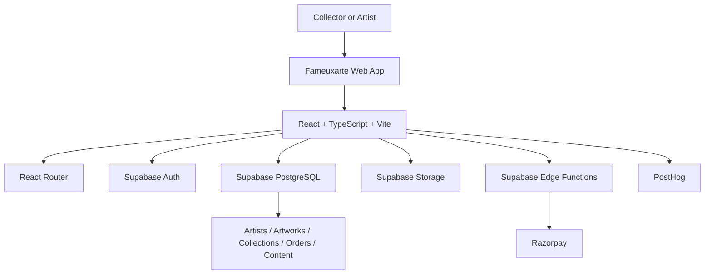

# Fameuxarte

## Technology-driven online art marketplace

[](https://react.dev/)
[](https://www.typescriptlang.org/)
[](https://vitejs.dev/)
[](https://supabase.com/)
[](https://tailwindcss.com/)

> **Fameuxarte is a technology-driven online art marketplace designed to help artists get discovered, build trust with collectors, and sell original artwork online.**

**Art + Technology + Discovery + Trust + Marketplace**

[Live Demo → fameuxarte.com](https://www.fameuxarte.com) · [View repository](https://github.com/Arunkumar158/fameuxarte.com)

---

## Product overview

Fameuxarte brings together artwork discovery, artist profiles, trust workflows, and digital commerce in one web experience.

The platform addresses three practical marketplace challenges:

- **Discovery:** helping collectors browse artwork through collections, categories, styles, mediums, subjects, colors, and locations.
- **Trust:** providing artist onboarding, identity-document submission, review workflows, trust statuses, certificates, and certificate verification.
- **Access:** giving artists a digital place to manage portfolios and artwork while giving collectors a structured way to discover, save, purchase, and manage their collection.

The repository contains a React/Vite web application backed by Supabase services and protected role-specific application areas for collectors, artists, and administrators.

## Core capabilities

### Artwork discovery

- Artwork listing and detail pages
- Search and programmatic discovery pages
- Browsing by collection, category, style, medium, subject, location, and color
- Artist directory and artist detail pages
- Likes, saved collections, following, and collector collection views
- SEO utilities, canonical metadata, structured data, and sitemap-generation scripts

### Artist ecosystem

- Artist application and onboarding flow
- Artist dashboard and portfolio preview
- Artwork and collection management
- Artist order management
- Artist analytics view
- Verification center with government ID and optional selfie upload
- Verification status, trust score, reviewer feedback, and trust badges

### Commerce

- Cart management
- Authenticated checkout
- Razorpay payment checkout
- Supabase Edge Functions for order creation and payment verification
- Order success and payment failure flows
- Collector orders, addresses, certificates, and collection views
- Legal acceptance recording during checkout

### Trust and operations

- Public certificate verification by certificate number
- Admin verification-management workflow
- Protected admin, artist, and collector routes
- Supabase Storage for identity documents
- Support ticketing for collectors and administrators
- In-app notifications and email-related administrative workflows
- Admin management for artworks, artists, orders, collections, SEO, analytics, insights, and digital products

### Content and engagement

- Blog and insight pages
- Resources, community, FAQ, contact, and story pages
- Editorial content management in the admin area
- Artwork and artist view tracking
- PostHog analytics and custom product events

## AI and intelligent features

The current repository does **not** demonstrate a meaningful implemented AI model, inference service, recommendation engine, or computer-vision pipeline.

The application includes analytics events related to discovery and AI-readiness checks, but these are instrumentation—not AI functionality. Potential future directions may include semantic artwork discovery, recommendations, or pricing insights; these are not presented as current features.

## Technology stack

| Layer | Verified technology |
|---|---|
| Frontend | React 18 + Vite 5 |
| Language | TypeScript 5.5 |
| Styling | Tailwind CSS 3.4 |
| UI components | shadcn/ui patterns with Radix UI primitives |
| Routing | React Router |
| Data fetching | TanStack React Query |
| Backend services | Supabase |
| Authentication | Supabase Auth, including email/password and Google OAuth flows |
| Database | Supabase PostgreSQL |
| File storage | Supabase Storage |
| Server-side functions | Supabase Edge Functions |
| Payments | Razorpay |
| Product analytics | PostHog |
| UI motion | Framer Motion and GSAP |
| Charts | Recharts |
| Deployment configuration | Vercel configuration is included in the repository |
| Runtime | Node.js 22.x |

## Architecture



## Key workflows

### Artist onboarding and verification

```text
Artist applies
    ↓
Identity documents submitted
    ↓
Verification status moves through review
    ↓
Admin reviews documents and feedback
    ↓
Artist is approved, rejected, or asked to resubmit
    ↓
Verified artist receives a trust badge and can manage marketplace content
```

### Artwork purchase

```text
Discover artwork
    ↓
Open artwork details
    ↓
Add artwork to cart
    ↓
Sign in and accept buyer/return terms
    ↓
Create order through Supabase Edge Function
    ↓
Pay through Razorpay
    ↓
Verify payment through Supabase Edge Function
    ↓
View order confirmation and manage the purchase in the collector area
```

## Security and trust controls

The repository includes the following implemented controls:

- Supabase Auth session handling and sign-out flows
- Email/password authentication and Google OAuth
- Protected route wrappers for admin, artist, and collector areas
- JWT verification enabled for the `create-order` and `verify-payment` Edge Functions
- Supabase Row Level Security policies in migrations
- Storage policies for identity-document access
- Signed URLs for admin review of identity documents
- Separate artist verification statuses and reviewer notes
- Payment verification through a backend Edge Function rather than trusting only the browser response
- Zod and form-validation dependencies for typed input-validation workflows
- Legal document version lookup and checkout acceptance recording

These controls document repository behavior; they are not a claim of certification or enterprise security compliance.

## Project structure

```text
.
├── src/
│   ├── components/       # Shared UI, navigation, admin, artist, and collector components
│   ├── contexts/         # Auth, cart, and currency state
│   ├── hooks/             # Reusable React hooks
│   ├── integrations/     # Supabase client and generated types
│   ├── lib/               # Analytics, SEO, notifications, and utilities
│   ├── pages/             # Public, admin, artist, collector, legal, and discovery pages
│   ├── providers/         # Discovery and PostHog providers
│   ├── types/             # Application types
│   └── App.tsx            # Application routes and providers
├── scripts/              # Slug, artwork, and sitemap utilities
├── supabase/
│   ├── functions/         # Edge Functions for commerce and communications
│   └── migrations/        # Database, RLS, storage, trust, commerce, and content migrations
├── public/                # Public static assets
├── package.json
├── tailwind.config.ts
├── vite.config.ts
└── vercel.json
```

## Local development

### Prerequisites

- Node.js 22.x
- npm, pnpm, or Bun
- Access to the configured Supabase project for data-backed flows

### Install and run

```bash
git clone https://github.com/Arunkumar158/fameuxarte.com.git
cd fameuxarte.com
npm install
npm run dev
```

The Vite development server will print the local URL in the terminal.

### Available commands

```bash
npm run dev                       # Start the Vite development server
npm run build                     # Create a production build
npm run build:dev                 # Create a development-mode build
npm run preview                   # Preview the production build
npm run lint                      # Run ESLint
npm run update-slugs              # Update artwork slugs
npm run test-slugs                # Test slug generation
npm run debug-artworks            # Run artwork diagnostics
npm run test-artwork-fetch        # Test artwork fetching
npm run generate-sitemaps         # Generate sitemaps
npm run generate-discovery-sitemaps # Generate discovery sitemap data
```

## Configuration

The current frontend Supabase client is generated in `src/integrations/supabase/client.ts` and references the configured Supabase project. No `.env.example` file is present in the repository, so environment-variable names should not be inferred or added here without first standardizing the application configuration.

Do not commit private keys, service-role keys, payment secrets, or other credentials to the repository. Supabase Edge Functions require their server-side payment and email configuration to be managed in the Supabase project environment.

## Deployment

The repository includes a `vercel.json` with:

- `pnpm install --no-frozen-lockfile` as the install command
- A rewrite from all paths to `/index.html` for the Vite SPA

The documented deployment shape is therefore:

```text
GitHub repository
      ↓
Vercel-hosted Vite application
      ↓
Supabase Auth / PostgreSQL / Storage / Edge Functions
      ↓
Razorpay checkout and payment verification
```

The repository does not document a CI/CD workflow, monitoring setup, or infrastructure-as-code system, so those are intentionally not claimed here.

## Roadmap

The following directions are intentionally separated from current functionality:

- **Exploring:** semantic artwork search and recommendation experiences
- **Exploring:** AI-assisted artwork discovery and pricing insights
- **Planned:** broader international commerce and localization support
- **Planned:** additional collector and artist engagement tools
- **Planned:** deeper digital provenance and trust experiences

Roadmap items are not represented as implemented features.

## Product vision

Fameuxarte is evolving toward a digital-first art marketplace where discovery is easier, artist identity and artwork information are clearer, and buying original artwork feels more trustworthy online.

The long-term product direction is centered on:

- Better artist discovery
- Digital art commerce
- Trust and verification
- Useful marketplace analytics
- More intelligent discovery over time
- Accessible art experiences across regions

## Contributing

When contributing:

1. Create a focused feature branch.
2. Keep changes scoped to the product area being improved.
3. Run `npm run lint` and `npm run build` before opening a pull request.
4. Update documentation when behavior or setup changes.
5. Never commit secrets or private service credentials.

## License

No root-level `LICENSE` file was verified during the repository audit. Add and document a license before describing the project as MIT-licensed.

## Links

- Live website: [www.fameuxarte.com](https://www.fameuxarte.com)
- GitHub repository: [Arunkumar158/fameuxarte.com](https://github.com/Arunkumar158/fameuxarte.com)

---

Built as a product and engineering platform for artists, collectors, and marketplace partners.
